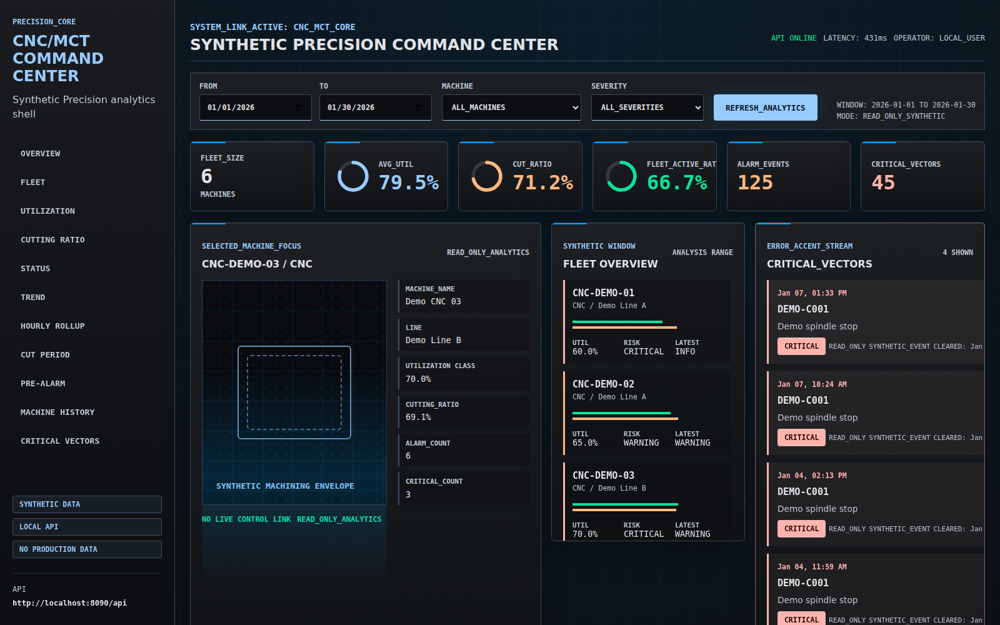
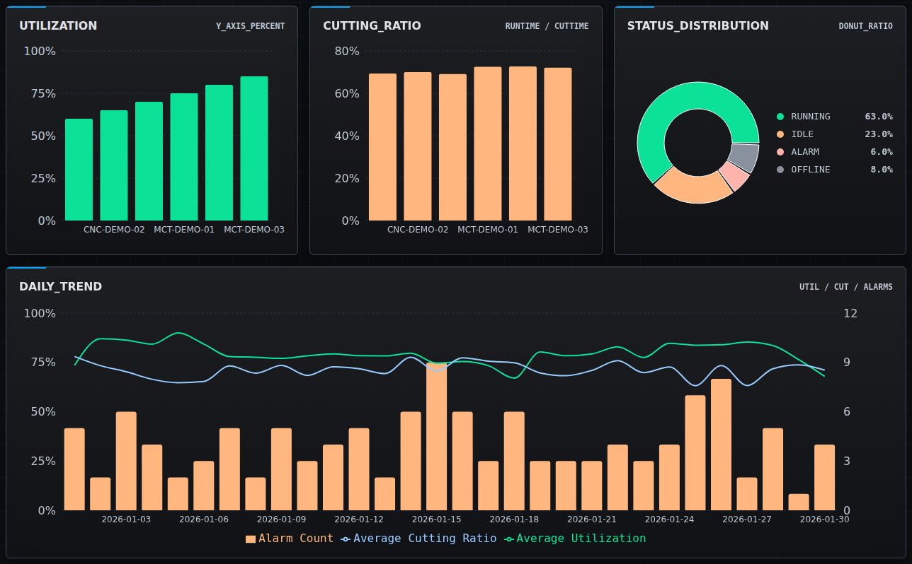
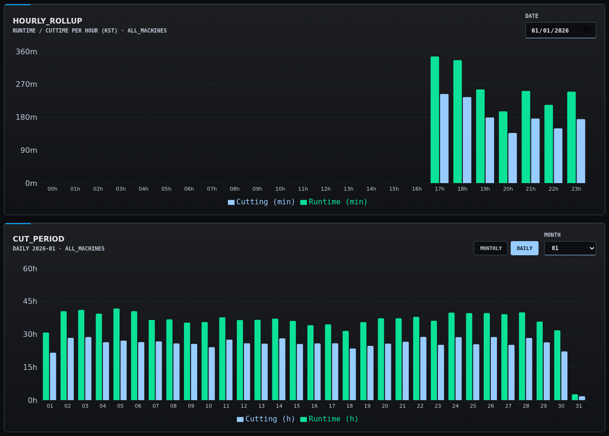
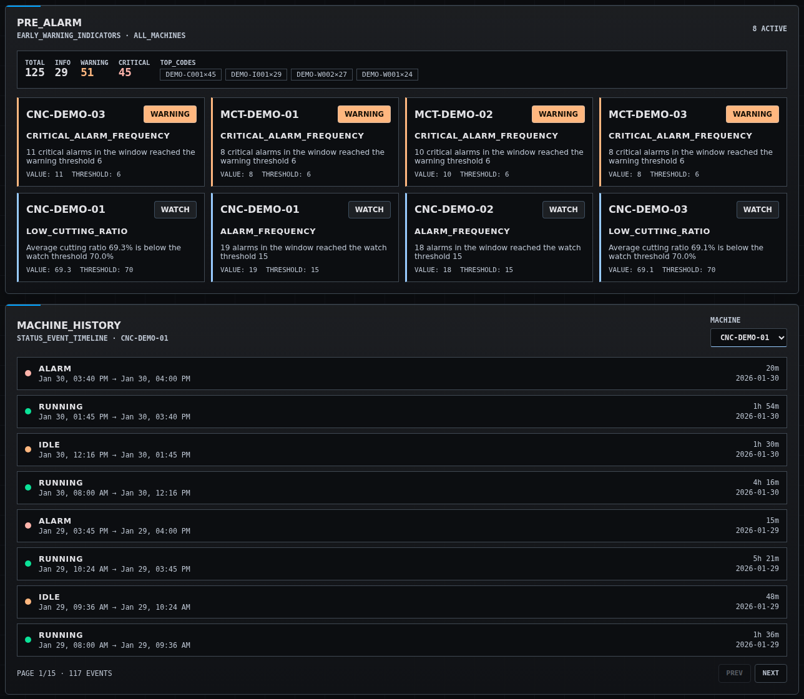
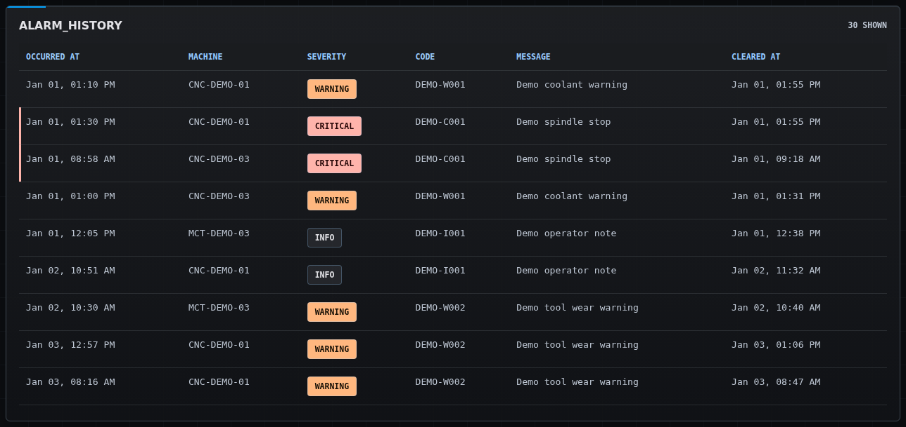
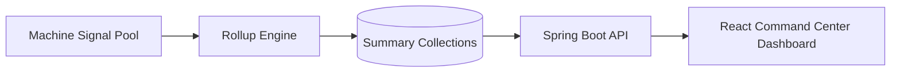

# CNC/MCT Analytics Dashboard

실제 운영·배포한 CNC/MCT 제조 설비 분석 대시보드 프로젝트의 **공개 포트폴리오 재구성**입니다. Spring Boot 백엔드, MongoDB, React 프론트엔드로 구성됩니다.

원본 시스템은 CNC/MCT 설비에서 수집한 신호를 집계해 가동률·절삭시간·알람·설비 상태를 모니터링하는 프로덕션 대시보드로, 현장에서 운영·배포되었습니다. 이 저장소는 그 시스템의 아키텍처·집계 엔진·대시보드 워크플로를 **동일한 엔지니어링으로 재구성**하되, 공개 안전을 위해 **합성 데이터로만 동작**하도록 만든 버전입니다.

운영 소스 덤프가 아니며 운영 데이터, 고객 데이터, 실제 DB 연결·설비 식별자·서버 주소·인증 정보·로그·인증서·비공개 환경값은 포함하지 않습니다. 모든 샘플 데이터는 합성 값입니다.

## 프로젝트 개요

제조 현장의 작업자·관리자가 여러 CNC/MCT 설비의 상태를 한 화면에서 검토하고, 원천 설비 신호를 실무 지표(가동률, 가동시간 대비 절삭시간 비율, 알람 이력, 상태 분포, 추세)로 변환해 일상 운영에 쓰도록 만든 시스템입니다.

핵심 분석 영역:

- 설비 가동률 (Equipment Utilization)
- 가동시간(RunTime) 대비 절삭시간(CutTime) 비율
- 알람 이력 (기간·설비·알람코드·심각도 필터)
- 설비 상태 분포 (RUNNING / IDLE / ALARM / OFFLINE)
- 일별·월별·연도별 추세
- KPI 카드 및 차트 기반 커맨드 센터 뷰

프론트엔드는 다크 테마의 `Synthetic Precision` 커맨드 센터 인터페이스를 사용하는 읽기 전용 대시보드입니다.

## 원본 프로덕션 시스템 규모

운영 시스템은 단일 대시보드 화면이 아니라 다음과 같은 **다중 분석 모듈**로 구성되었습니다(이 공개 저장소는 그중 핵심 분석·집계 흐름을 재구성합니다):

| 영역 | 모듈 | 공개 재구성 |
| --- | --- | --- |
| 절삭 모니터링 | 일간 / 월간 / 연간 절삭·가동 집계 | ✅ 시간별 롤업 + `CUT_PERIOD` 월/일 뷰 |
| 설비 이력 | 설비별 상태·이벤트 이력 조회 | ✅ `MACHINE_HISTORY` 페이지네이션 타임라인 |
| 설비 가동률 | 가동률 요약·추세 | ✅ 가동률 차트 / KPI |
| 설비 상태 | 실시간/최근 설비 상태 분포 | ✅ 상태 분포 차트 |
| 성능 분석 | 월간 / 기간 / 연간 성능 지표 | 일별 추세로 재구성 |
| 예지 알람 | 임계 기반 사전 알람 뷰 | ✅ `PRE_ALARM` 조기경고 규칙 엔진 |
| 스핀들 / 팬 | 스핀들·팬 상태 이력 | 미포함 |
| 공구 사용량 | 공구 사용량 요약 | 미포함 |
| 종합 가동률 | 전체 설비 유틸라이제이션 | ✅ KPI / 플릿 오버뷰 |
| 마스터 | 설비 / 캘린더 / 사용자 / 프로그램 마스터 | 설비 마스터만(읽기 전용) |

원본은 위 모듈과 함께 인증(JWT)·권한, 설비 마스터 매핑, 스케줄 집계 파이프라인을 갖춘 배포 시스템이었으며, 운영 인프라·인증·고객별 구현은 이 공개 저장소에 포함하지 않습니다.

## 핵심 엔지니어링: 롤업 집계 엔진

이 프로젝트의 가장 중요한 엔지니어링 자산은 **누적 신호를 시간단위 델타로 변환하는 롤업 집계 엔진**입니다. 설비에서 수집되는 `RunTime`/`CutTime`은 계속 증가하는 누적 카운터라, 그대로 합산하면 대시보드 지표가 왜곡됩니다. 롤업 엔진은 이를 다음과 같이 처리합니다:

- 연속된 두 카운터 값의 **델타**로 실제 가동/절삭 시간을 계산
- **카운터 리셋**(음수 델타), **긴 유휴 갭**(> 10분), **비정상 점프**(스텝 상한 120초)를 보정
- KST 기준 `(설비, 날짜, 시)` 버킷으로 집계해 사전 요약 컬렉션에 upsert
- 대시보드 조회 시 원천 이벤트를 매번 스캔하지 않고 요약 컬렉션만 읽어 응답 속도 확보

상세는 [docs/ROLLUP_ARCHITECTURE.md](docs/ROLLUP_ARCHITECTURE.md) 참고. 보정 규칙은 `DeltaRule`로 분리되어 단위 테스트로 검증됩니다(`backend/src/test/.../DeltaRuleTest.java`).

## 담당 역할

**역할: 단독 개발 (설계 · 백엔드 · 프론트엔드 · 배포)**

- Spring Boot 백엔드 API 설계 및 구현
- React + TypeScript 대시보드 프론트엔드 설계 및 구현
- MongoDB 스키마 및 신호/요약 컬렉션 데이터 모델링
- 누적 신호 → 시간단위 델타 롤업 집계 엔진 설계 및 구현
- 설비 가동률·RunTime/CutTime 비율·알람 이력·상태 분포 분석 구현
- 스케줄 집계 및 히스토리 백필 파이프라인 구현
- KPI 카드 및 차트 기반 대시보드 패널 구현
- 현장 운영·배포 및 트러블슈팅

## 기술 스택

| 영역 | 스택 |
| --- | --- |
| Frontend | Vite, React, TypeScript |
| 차트 시각화 | Recharts |
| Backend | Spring Boot 3.x (Java 17) |
| Database | MongoDB |
| 집계 | 스케줄 롤업 엔진 (Spring `@Scheduled`), MongoDB bulk upsert |
| 샘플 데이터 | Python seed script, JSON |
| 로컬 런타임 | Docker Compose |
| 빌드 도구 | Gradle, npm |

## 스크린샷

### Command Center Overview



### Analytics Panels



### Rollup Engine — Hourly & Period Views



### Pre-Alarm & Machine History



### Alarm History



## 아키텍처



원본 프로덕션 시스템은 실제 설비 인터페이스에서 신호를 수집했으나, 이 공개 저장소는 동일한 파이프라인을 합성 신호 풀로 재구성합니다. 실제 운영 데이터·설비 인터페이스·인증·배포 인프라는 포함하지 않습니다.

## 저장소 구조

```text
cnc-mct-analytics-dashboard
├─ backend/                 # Spring Boot API + 롤업 집계 엔진
│  └─ .../rollup/           # 롤업 스케줄러·서비스·집계·인덱스·백필
├─ frontend/                # React + TypeScript 대시보드
├─ sample-data/             # 합성 JSON 샘플 데이터 (신호 풀 포함)
├─ scripts/                 # 데이터 생성 및 런타임 테스트 스크립트
├─ screenshots/             # 공개 스크린샷
├─ docs/                    # 아키텍처, 롤업, API, 스키마, 보안, 데이터 고지
├─ docker-compose.yml       # 로컬 MongoDB 런타임
└─ README.md
```

## 핵심 엔지니어링 포인트

- **롤업 집계 엔진**: 누적 신호를 시간단위 델타로 변환하고, 리셋·긴 갭·비정상 점프를 보정해 신뢰할 수 있는 지표를 생성합니다.
- **요약 데이터 기반 성능 설계**: 사전 집계한 요약 컬렉션(`runtime_daily`, `cuttime_daily`)에서 대시보드를 조회해, 원천 신호가 늘어도 조회 성능이 안정적입니다.
- **스케줄 + 백필 이원화**: 운영 중에는 최근 윈도우만 짧게 자주 집계하고, 히스토리는 백필 러너로 한 번에 재집계합니다.
- **테스트 가능한 도메인 규칙**: 델타 보정 규칙을 `DeltaRule`로 순수 함수화해 DB 없이 단위 테스트합니다.
- **보안을 고려한 공개 범위 통제**: 운영 소스, 인증 정보, 비공개 인프라 값, 고객 데이터, 로그, 인증서를 의도적으로 제외했습니다.

## 샘플 데이터

로컬 합성 샘플 데이터 생성:

```bash
python scripts/generate_sample_data.py
```

`sample-data/`에 생성되는 파일은 합성 값이며, 실제 운영 시스템에서 복사한 데이터가 아닙니다.

합성 컬렉션:

- `machines`
- `status_history`
- `runtime_cuttime`
- `alarm_history`
- `daily_summary`
- `machine_signal_pool` — 롤업 엔진 입력(누적 RunTime/CutTime 신호)
- `runtime_daily` / `cuttime_daily` — 롤업 타깃 시드(전체 범위, 신호 구간은 엔진과 동일 값)

## 백엔드

Spring Boot 백엔드는 `backend/`에 있으며, 합성 MongoDB 컬렉션에 대한 읽기 전용 대시보드 API와 롤업 집계 엔진을 포함합니다.

기본 설정:

| 항목 | 값 |
| --- | --- |
| Java | 17 |
| Spring Boot | 3.x |
| 서버 포트 | `8090` |
| MongoDB URI | `${MONGODB_URI:mongodb://localhost:27017/cnc_mct_demo}` |
| CORS Origins | `http://localhost:3000`, `http://localhost:5173` |
| 롤업 스케줄 | `rollup.enabled`, `rollup.cron`, `rollup.lookback-days` |

빌드/실행:

```bash
cd backend
gradle bootRun      # 또는 ./gradlew bootRun
```

백엔드는 시작 시 대상 컬렉션이 비어 있을 때만 `sample-data/*.json`을 MongoDB로 임포트합니다.

### 롤업 실행

스케줄 집계(운영 모드, 5분마다 최근 윈도우 집계):

```bash
gradle bootRun --args="--rollup.enabled=true --rollup.lookback-days=2"
```

히스토리 백필(합성 샘플 범위 전체 집계 — 샘플 데이터는 2026-01 범위이므로 버킷을 채우려면 백필 사용):

```bash
gradle bootRun --args="--rollup.backfill.enabled=true --rollup.backfill.from=2026-01-01 --rollup.backfill.to=2026-01-04"
```

집계 결과 조회:

```text
GET http://localhost:8090/api/rollup/hourly?date=2026-01-01
```

엔드포인트 상세는 [docs/API.md](docs/API.md), 집계 상세는 [docs/ROLLUP_ARCHITECTURE.md](docs/ROLLUP_ARCHITECTURE.md) 참고.

## 프론트엔드

React 프론트엔드는 `frontend/`에 있으며, `VITE_API_BASE_URL`을 통해 백엔드 API를 호출합니다.

```env
VITE_API_BASE_URL=http://localhost:8090/api
```

실행:

```bash
cd frontend
npm install
npm run dev
```

접속: `http://localhost:5173`

프론트엔드는 공개 저장소에서 읽기 전용으로 구성되었습니다. 인증, 사용자 관리, 파일 업로드/다운로드, mock fallback이 없으며, API 오류는 화면에 표시됩니다. 상세는 [docs/FRONTEND.md](docs/FRONTEND.md) 참고.

## 로컬 런타임

```bash
docker compose up -d mongo      # 로컬 MongoDB
cd backend && gradle bootRun    # 백엔드 API + 롤업 엔진
cd frontend && npm install && npm run dev   # 프론트엔드
```

접속: `http://localhost:5173`

전체 런타임 테스트 흐름과 트러블슈팅은 [docs/RUNTIME_TEST.md](docs/RUNTIME_TEST.md) 참고.

## 보안 및 데이터 고지

이 저장소의 모든 데이터는 합성 샘플 데이터입니다. 설비명, 식별자, 타임스탬프, 알람 레코드, 가동률 값 등은 모두 공개용 합성 값이며, 운영 데이터·고객 데이터·실제 설비 이력을 노출하지 않습니다.

다음 항목은 이 저장소에 추가하지 마십시오:

- 운영 `.env` 파일 / 실제 DB URI / 서버 IP
- 인증 정보 / API 키 / 인증서 / 로그 / DB 덤프
- 운영 소스코드 / 운영 Git 히스토리
- 고객 스크린샷 / 실제 설비 데이터 / 고객별 운영 레코드

상세: [Security Notice](docs/SECURITY.md) · [Data Notice](docs/DATA_NOTICE.md)

## 공개 범위 한계

이 공개 저장소는 안전한 포트폴리오 공유를 위해 의도적으로 다음을 제외했습니다: 운영 인증/인가, 실제 설비 인터페이스, 실시간 운영 데이터 연결, 고객별 대시보드 로직, 운영 배포 스크립트, 비공개 인프라 구성, 비공개 Git 히스토리.

## 문서

| 문서 | 설명 |
| --- | --- |
| [Architecture](docs/ARCHITECTURE.md) | 시스템 아키텍처 및 데이터 흐름 |
| [Rollup Architecture](docs/ROLLUP_ARCHITECTURE.md) | 누적 신호 → 시간단위 델타 롤업 집계 엔진 |
| [API Reference](docs/API.md) | 백엔드 API 엔드포인트 및 응답 형식 |
| [Frontend](docs/FRONTEND.md) | 프론트엔드 구조 및 런타임 노트 |
| [Runtime Test](docs/RUNTIME_TEST.md) | 로컬 런타임 테스트 흐름 및 트러블슈팅 |
| [Data Schema](docs/DATA_SCHEMA.md) | MongoDB 스키마 및 컬렉션 구조 |
| [Security Notice](docs/SECURITY.md) | 보안, 익명화, 공개 정책 |
| [Data Notice](docs/DATA_NOTICE.md) | 합성 데이터 및 데이터 처리 고지 |
| [Case Study](docs/CASE_STUDY_CNC_MCT_DASHBOARD.md) | CNC/MCT 대시보드 케이스 스터디 |
| [Reuse Candidates](docs/REUSE_CANDIDATES.md) | 재사용 가능 모듈 및 확장 후보 |

## 라이선스 / 사용

공개 포트폴리오 목적으로 제공됩니다. 일부라도 재사용하기 전에 저장소 라이선스와 보안 고지를 확인하십시오.
