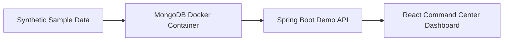
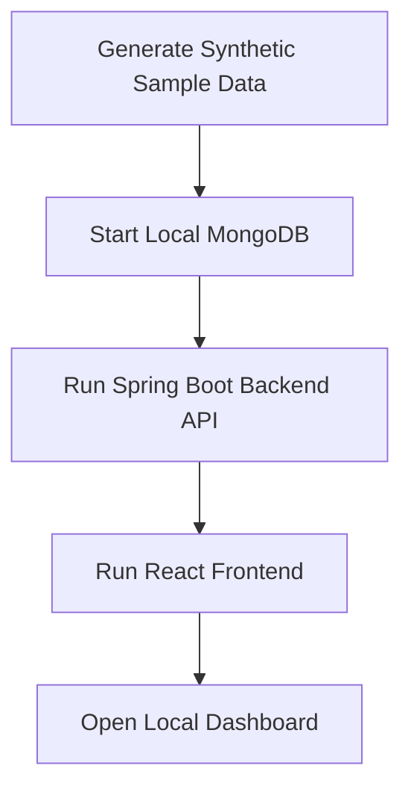

# CNC/MCT Analytics Dashboard Demo

Synthetic CNC/MCT manufacturing analytics dashboard demo built with a Spring Boot backend, MongoDB sample dataset, and React frontend.

This repository is a public demo rebuilt from the architecture, dashboard workflow, and engineering experience of a real deployed CNC/MCT manufacturing dashboard project.

It is not a copy of production source code and does not include production data, customer data, real database connections, real equipment history, server IP addresses, private credentials, logs, certificates, or private environment values.

All demo data is synthetic sample data.

## Overview

CNC/MCT Analytics Dashboard Demo is a local-only manufacturing dashboard demo for equipment monitoring and operational analytics.

The demo focuses on the following analytics areas:

* Equipment utilization
* RunTime / CutTime cutting ratio
* Alarm history
* Machine status distribution
* Daily trend charts
* KPI cards and chart-based dashboard views

The frontend uses a dark `Synthetic Precision` command-center interface.
It is read-only and replaces unavailable live camera, G-code, production control, and site-specific operational functions with synthetic analytics panels derived from the local demo API.

## Production Background

This public repository was rebuilt from experience gained during a deployed CNC/MCT manufacturing dashboard project.

The original production system handled manufacturing equipment data, dashboard APIs, machine utilization metrics, RunTime / CutTime analysis, alarm history, equipment status distribution, and operational trend views.

This repository is not a one-to-one copy of the production system.
It preserves the main engineering concepts while replacing production-specific implementation details with synthetic data, simplified local runtime components, and read-only demo screens.

The following production-only assets are intentionally excluded:

* Production source code
* Production screenshots
* Customer-specific information
* Real equipment data
* Real machine history
* Server addresses
* Private credentials
* Private Git history
* Infrastructure-specific deployment configuration

See the anonymized case study:

* [CNC/MCT Manufacturing Dashboard Case Study](docs/CASE_STUDY_CNC_MCT_DASHBOARD.md)

## Demo Scope

The demo shows analytics workflows for CNC/MCT equipment using a local-only stack.

Included:

* Dashboard overview
* Equipment utilization KPI
* RunTime / CutTime cutting ratio analytics
* Alarm history summary
* Machine status distribution
* Daily trend charts
* Synthetic MongoDB sample data
* Read-only Spring Boot API
* React dashboard visualization

Excluded:

* Production authentication
* Production authorization
* Real database connection
* Live equipment connection
* Real-time machine interface
* Camera integration
* G-code integration
* Production control commands
* File upload/download
* Customer-specific business rules
* Private deployment scripts

## My Role / Contribution

Role: Sole developer

Contribution:

* Designed and implemented the Spring Boot backend API.
* Designed and implemented the React + TypeScript dashboard frontend.
* Designed the MongoDB demo schema and synthetic sample dataset.
* Implemented equipment utilization analytics.
* Implemented RunTime / CutTime cutting ratio dashboard logic.
* Implemented alarm history analytics.
* Implemented machine status distribution views.
* Implemented KPI cards and chart-based dashboard panels.
* Rebuilt the public demo repository from the architecture and workflows of a real deployed manufacturing dashboard project.
* Removed production source code, production data, customer information, credentials, infrastructure details, private environment values, and private Git history.

## Tech Stack

| Area                | Stack                    |
| ------------------- | ------------------------ |
| Frontend            | Vite, React, TypeScript  |
| Chart Visualization | Recharts                 |
| Backend             | Spring Boot 3.x          |
| Database            | MongoDB                  |
| Sample Data         | Python seed script, JSON |
| Local Runtime       | Docker Compose           |
| Build Tools         | Gradle, npm              |

## Screenshots

### Command Center Overview


### Analytics Panels


### Alarm History


## Architecture



The production project followed the same general dashboard concept, but used operational manufacturing data, real equipment interfaces, production authentication, and deployment-specific infrastructure that are not included in this repository.

## Local Demo Flow



## Repository Structure

```text
cnc-mct-analytics-dashboard-demo
├─ backend/                 # Spring Boot demo API
├─ frontend/                # React + TypeScript dashboard
├─ sample-data/             # Synthetic JSON sample data
├─ scripts/                 # Data generation and runtime test scripts
├─ screenshots/             # Public demo screenshots
├─ docs/                    # Architecture, API, schema, security, data notice
├─ docker-compose.yml       # Local MongoDB runtime
└─ README.md
```

## Sample Data

Generate local synthetic sample data with:

```bash
python scripts/generate_sample_data.py
```

The generated files under `sample-data/` are fake demo records only.
They are not copied from real production systems.

Synthetic sample collections:

* `machines`
* `status_history`
* `runtime_cuttime`
* `alarm_history`
* `daily_summary`

## Backend

The Spring Boot backend lives in `backend/`.

It exposes read-only demo APIs over synthetic MongoDB collections.

Configuration defaults:

| Item         | Value                                                   |
| ------------ | ------------------------------------------------------- |
| Java         | 17                                                      |
| Spring Boot  | 3.x                                                     |
| Server Port  | `8090`                                                  |
| MongoDB URI  | `${MONGODB_URI:mongodb://localhost:27017/cnc_mct_demo}` |
| CORS Origins | `http://localhost:3000`, `http://localhost:5173`        |

Run with the included Gradle wrapper:

```powershell
cd backend
.\gradlew.bat bootRun
```

Build:

```powershell
cd backend
.\gradlew.bat build
```

On startup, the backend imports `sample-data/*.json` into MongoDB only when the target collections are empty.
The loader works from either the repository root or the `backend/` directory.

See [docs/API.md](docs/API.md) for endpoint details and response examples.

## Frontend

The React frontend lives in `frontend/`.

It calls the backend API through `VITE_API_BASE_URL`.

Default API URL:

```env
VITE_API_BASE_URL=http://localhost:8090/api
```

Run:

```powershell
cd frontend
npm install
npm run dev
```

Open:

```text
http://localhost:5173
```

Build:

```powershell
cd frontend
npm run build
```

The frontend is intentionally read-only for the public demo.
It has no authentication, JWT handling, user administration, file upload/download, or mock fallback. API errors are shown on screen.

See [docs/FRONTEND.md](docs/FRONTEND.md) for frontend details.

## Local Runtime

Run MongoDB:

```powershell
docker compose up -d mongo
```

Run backend:

```powershell
cd backend
.\gradlew.bat bootRun
```

In a new PowerShell session, run frontend:

```powershell
cd frontend
npm install
npm run dev
```

Open:

```text
http://localhost:5173
```

To smoke test the backend API from the repository root:

```powershell
.\scripts\test_backend_api.ps1
```

See [docs/RUNTIME_TEST.md](docs/RUNTIME_TEST.md) for the full runtime test flow and troubleshooting notes.

## Key Engineering Points

### 1. Public Demo Reconstruction

The repository is not a production source dump.
It was rebuilt as a public demo while preserving the main dashboard architecture and analytics workflow.

### 2. Synthetic Manufacturing Dataset

The sample dataset is designed to represent CNC/MCT dashboard scenarios without exposing real equipment history or customer data.

### 3. Read-Only Analytics API

The backend provides read-only dashboard APIs for portfolio review and local testing.

### 4. Dashboard-Oriented Frontend

The frontend focuses on KPI visibility, operational status, chart-based analysis, and quick dashboard review.

### 5. Security-Aware Disclosure Control

Production source code, credentials, private infrastructure values, customer data, logs, certificates, and private Git history are intentionally excluded.

## Security Notice

Do not add any of the following items to this repository:

* Production `.env` files
* Real DB URIs
* Server IPs
* Credentials
* API keys
* Certificates
* Logs
* Database dumps
* Customer screenshots
* Production source code
* Production Git history
* Real equipment data
* Customer-specific operational records

This repository is intended for portfolio review and local demonstration only.

See:

* [Security Notice](docs/SECURITY.md)
* [Data Notice](docs/DATA_NOTICE.md)

## Data Notice

All demo data in this repository is synthetic sample data.

The dataset is designed to represent the structure and workflow of a CNC/MCT manufacturing dashboard without exposing production data, customer data, real equipment history, or private operational records.

Any equipment names, identifiers, timestamps, alarm records, utilization values, and KPI values included in this repository are demo-only values.

## Documentation

| Document                                           | Description                                    |
| -------------------------------------------------- | ---------------------------------------------- |
| [Architecture](docs/ARCHITECTURE.md)               | System architecture and data flow overview     |
| [API Reference](docs/API.md)                       | Backend API endpoints and response format      |
| [Frontend](docs/FRONTEND.md)                       | Frontend structure and runtime notes           |
| [Runtime Test](docs/RUNTIME_TEST.md)               | Local runtime test flow and troubleshooting    |
| [Data Schema](docs/DATA_SCHEMA.md)                 | MongoDB demo schema and collection structure   |
| [Security Notice](docs/SECURITY.md)                | Security, anonymization, and disclosure policy |
| [Data Notice](docs/DATA_NOTICE.md)                 | Synthetic data and data handling notice        |
| [Case Study](docs/CASE_STUDY_CNC_MCT_DASHBOARD.md) | Anonymized CNC/MCT dashboard case study        |
| [Reuse Candidates](docs/REUSE_CANDIDATES.md)       | Reusable modules and extension candidates      |

## Limitations

This public demo is intentionally limited.

It does not include:

* Production authentication
* Production authorization
* Real equipment interface
* Real-time production data connection
* Customer-specific dashboard logic
* Production deployment scripts
* Private infrastructure configuration
* Production Git history

These limitations are intentional to keep the repository safe for public portfolio use.

## License / Usage

This repository is provided as a public portfolio demo.
Before reusing any part of the project, review the repository license and security notice.
