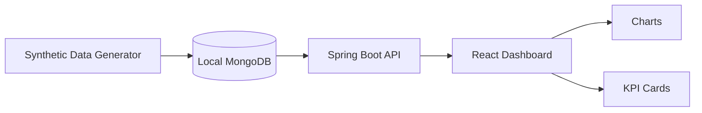

# Public Demo Architecture

This architecture is designed for a public portfolio demo. It is intentionally different from any private production architecture and uses only local services with synthetic data.

## Planned Components

## Planned Flow

1. A local synthetic data generator creates fake CNC/MCT equipment records.
2. The generated records are inserted into local MongoDB.
3. The Spring Boot API reads aggregated demo data from MongoDB.
4. The React dashboard calls the local API.
5. Charts and KPI cards visualize utilization, RunTime, CutTime, alarms, and status trends.

## Public Demo Boundaries

- Local MongoDB only.
- No production database connection.
- No customer network, internal IP, VPN, or private host dependency.
- No private source history.
- No real logs, screenshots, credentials, or operational data.
