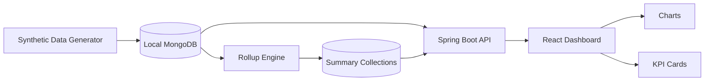

# 아키텍처

이 문서는 공개 포트폴리오 저장소의 아키텍처를 설명합니다. 원본 프로덕션 시스템의 데이터 흐름과 집계 구조를 동일한 엔지니어링으로 재구성하되, 합성 데이터를 사용하는 로컬 서비스만으로 구성됩니다.

## 구성 요소

## 데이터 흐름

1. 로컬 합성 데이터 생성기가 설비 마스터·상태 이력·알람·**누적 신호 풀**(`machine_signal_pool`)을 생성합니다.
2. 생성된 레코드를 로컬 MongoDB에 삽입합니다(대상 컬렉션이 비어 있을 때만).
3. **롤업 엔진**이 누적 신호를 시간단위 델타로 변환해 요약 컬렉션(`runtime_daily`, `cuttime_daily`)에 upsert합니다. (스케줄 또는 백필)
4. Spring Boot API가 원천/요약 컬렉션에서 대시보드용 데이터를 조회합니다.
5. React 대시보드가 로컬 API를 호출하고, 차트·KPI 카드가 가동률·RunTime/CutTime·알람·상태 추세를 시각화합니다.

## 원천 데이터와 요약 데이터의 분리

가장 중요한 설계 결정은 **원천 신호와 대시보드용 요약 데이터를 분리**한 것입니다. 대시보드가 매 조회마다 대용량 원천 신호를 스캔하는 대신, 롤업 엔진이 사전 집계한 요약 컬렉션을 읽습니다. 이로써 원천 신호가 증가해도 조회 응답과 렌더링이 안정적으로 유지됩니다. 롤업 상세는 [ROLLUP_ARCHITECTURE.md](ROLLUP_ARCHITECTURE.md) 참고.

## 공개 저장소 경계

- 로컬 MongoDB만 사용
- 운영 DB 연결 없음
- 고객 네트워크, 내부 IP, VPN, 비공개 호스트 의존성 없음
- 비공개 소스 히스토리 없음
- 실제 로그, 스크린샷, 인증 정보, 운영 데이터 없음
