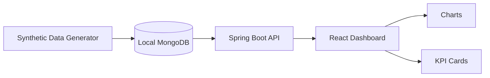

# 공개 데모 아키텍처

이 아키텍처는 공개 포트폴리오 데모를 위해 설계되었습니다. 비공개 운영 아키텍처와는 의도적으로 다르며, 합성 데이터를 사용하는 로컬 서비스만으로 구성됩니다.

## 구성 요소

## 데이터 흐름

1. 로컬 합성 데이터 생성기가 가짜 CNC/MCT 설비 레코드를 생성합니다.
2. 생성된 레코드를 로컬 MongoDB에 삽입합니다.
3. Spring Boot API가 MongoDB에서 집계된 데모 데이터를 조회합니다.
4. React 대시보드가 로컬 API를 호출합니다.
5. 차트와 KPI 카드가 가동률, RunTime, CutTime, 알람, 상태 추세를 시각화합니다.

## 공개 데모 경계

- 로컬 MongoDB만 사용
- 운영 DB 연결 없음
- 고객 네트워크, 내부 IP, VPN, 비공개 호스트 의존성 없음
- 비공개 소스 히스토리 없음
- 실제 로그, 스크린샷, 인증 정보, 운영 데이터 없음
