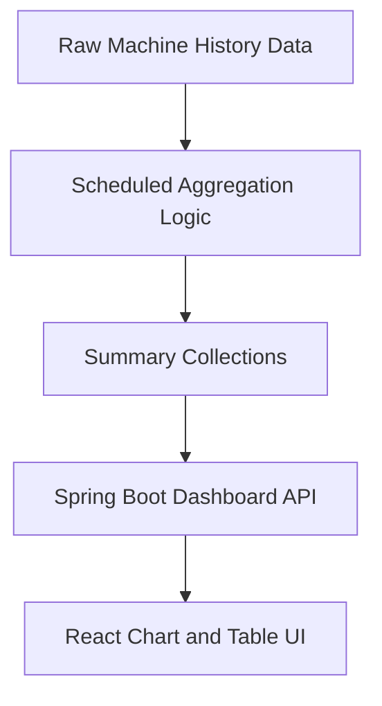
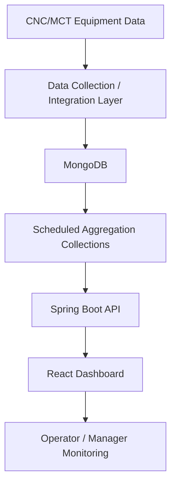
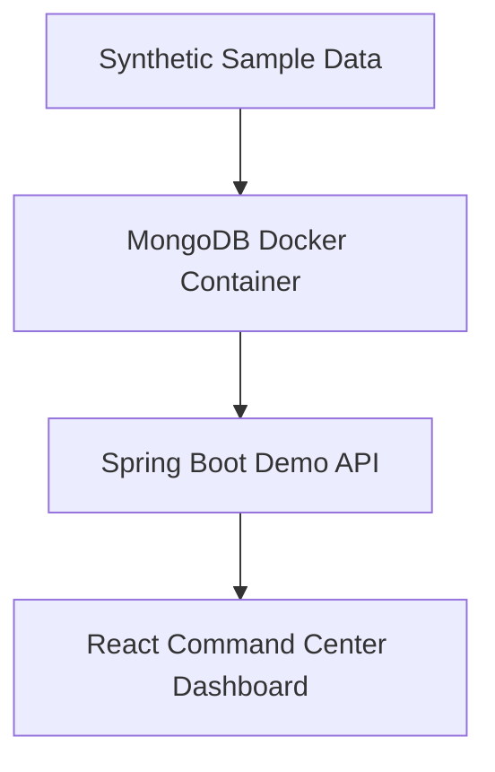

# Case Study: CNC/MCT Manufacturing Dashboard

## 1. Overview

This case study summarizes a deployed manufacturing dashboard project for CNC/MCT equipment monitoring and operational analytics.

The production system itself is not included in this public repository. This document describes the technical problem, development challenges, architecture, implementation approach, and lessons learned using anonymized and sanitized information only.

The public repository is a rebuilt portfolio demo that uses synthetic sample data.

## 2. Project Background

The original project was developed for a manufacturing environment where CNC/MCT equipment data was collected, stored, processed, and visualized through a dashboard system.

Operators and managers needed a practical way to review machine utilization, RunTime / CutTime cutting ratio, alarm history, machine status distribution, and daily operation trends.

The main purpose of the dashboard was not simply to display raw equipment data. The system had to convert collected machine records into meaningful operational indicators that could support daily monitoring and review.

Because the original system was deployed in an operational manufacturing environment, the following production-only assets are excluded from this public repository:

* Production source code
* Production database connections
* Production screenshots
* Customer-specific information
* Real equipment data
* Real alarm logs
* Server addresses
* Credentials, keys, tokens, certificates, and environment files
* Private Git history
* Internal deployment configuration

This public case study focuses on the engineering concepts and implementation approach rather than production-specific details.

## 3. Problem Statement

The project addressed the following issues:

* Equipment status was difficult to review across multiple CNC/MCT machines.
* RunTime and CutTime records needed to be transformed into meaningful utilization and cutting-ratio metrics.
* Alarm history needed to be searchable by machine, date range, alarm code, and severity.
* Large equipment history datasets caused query performance and frontend rendering concerns.
* Field stakeholders needed practical dashboard indicators for daily operation review, not raw machine records.
* The system required a maintainable backend API and frontend dashboard structure.
* Dashboard response time had to remain stable even when the underlying equipment history data increased.

## 4. Development Challenges

### 4.1 Defining meaningful equipment indicators

One of the most important challenges was deciding which equipment data was actually meaningful for field users.

The collected data contained many signals, status values, timestamps, and machine-specific records. However, not every collected value was useful for operators or managers.

During the project, I reviewed the available equipment data with field stakeholders and clarified which values should be treated as key dashboard indicators.

The review focused on questions such as:

* Which machine status values should be considered operating, stopped, alarm, or disconnected?
* Which records should be used for utilization analysis?
* How should RunTime and CutTime be interpreted?
* Which alarm records should be prioritized?
* Which indicators were useful for daily operational review rather than only for engineering analysis?

Through this process, the dashboard scope was refined around practical operational indicators:

* Equipment utilization
* RunTime / CutTime cutting ratio
* Alarm history
* Machine status distribution
* Daily trend analysis

### 4.2 Handling large volumes of equipment history data

Another major challenge was the volume of collected equipment history data.

If every dashboard screen queried raw event-level records directly, the system would have suffered from:

* Slow API responses
* Heavy frontend rendering
* Large chart payloads
* Inconsistent user experience
* Repeated calculation logic across screens

To solve this, the system separated raw operational data from dashboard-ready summary data.

Instead of calculating every metric at page load time, frequently used dashboard metrics were pre-calculated and stored in summary collections.

The dashboard API could then read from pre-aggregated collections instead of scanning large raw history datasets for every request.

This approach improved dashboard responsiveness and made frontend rendering more stable.

### 4.3 Interpreting manufacturing data semantics

Raw equipment records could not be used directly as dashboard metrics.

For example, RunTime and CutTime records had to be interpreted based on operational time intervals rather than simply summing raw snapshot values.

The aggregation logic was designed around explicit time-window rules. Runtime and cutting time were calculated from valid machine event ranges, and dashboard APIs returned structured metrics for frontend charts.

This made the dashboard more reliable because the displayed utilization and cutting-ratio values reflected the operational meaning of the data rather than raw record values.

### 4.4 Resolving equipment-code mapping issues

Another issue was the mismatch between internal equipment master codes and machine identifiers used in collected equipment data.

In some cases, dashboard rollups could not find the correct equipment records because the master data and collected data used different identifiers.

The solution was to define a clear mapping rule between the equipment master data and the collected machine data.

This allowed daily summaries and machine-level dashboard APIs to aggregate the correct records consistently.

### 4.5 Working within MongoDB deployment constraints

The production MongoDB environment had version and compatibility constraints.

Some newer aggregation operators and query patterns could not be used. Query logic had to be written in a way that remained compatible with the deployed environment.

This required careful handling of:

* Pattern matching
* Date-range filtering
* Aggregation stages
* Dashboard response shaping
* Query performance

The backend implementation was adjusted to keep the API compatible with the production environment while still returning frontend-ready dashboard data.

### 4.6 Balancing field requirements and system performance

Field users needed dashboard screens that were easy to understand and fast to load.

At the same time, the available data was large, detailed, and not always directly aligned with dashboard requirements.

The implementation had to balance both sides:

* Preserve the operational meaning of the original manufacturing data.
* Avoid overloading the dashboard with unnecessary signals.
* Pre-calculate frequently used metrics.
* Keep API responses small enough for chart rendering.
* Provide filters by date range, machine, alarm code, and severity.
* Keep the dashboard usable for daily operational review.

The dashboard was designed as an operational analytics layer built on top of manufacturing data, not as a raw data viewer.

## 5. Solution Approach

The solution used a MongoDB-backed Spring Boot API and a React dashboard.

The backend aggregated equipment operation records, runtime/cuttime data, machine status records, and alarm history into dashboard-ready API responses.

The frontend visualized those responses through KPI cards, charts, machine-level summaries, filters, and alarm history tables.

The most important design decision was separating raw data from dashboard-ready summary data.

This separation made the system easier to maintain.

Raw data remained available for detailed analysis, while the dashboard used summary collections optimized for fast visualization.

## 6. Architecture

The production architecture was conceptually structured as follows:

The public demo rebuilds the same general concept with local-only synthetic data:

The public demo does not include production equipment interfaces, production authentication, production infrastructure, or customer-specific implementation details.

## 7. Key Features

### 7.1 Equipment Utilization

The dashboard aggregates machine operation records and presents machine-level utilization indicators by date range.

This allows operators and managers to review equipment usage patterns without inspecting raw event records.

### 7.2 RunTime / CutTime Cutting Ratio

RunTime and CutTime records are converted into cutting-ratio metrics.

The purpose is to compare actual cutting time against machine runtime and provide a clearer view of equipment productivity.

### 7.3 Machine Status Distribution

Machine status records are summarized into distribution charts.

This helps users review running, stopped, alarm, disconnected, and other operational status patterns.

### 7.4 Alarm History

Alarm records are displayed by machine, severity, code, and time range.

The dashboard supports alarm review through summary charts and searchable tables.

### 7.5 Daily Trend Analysis

Daily utilization, cutting ratio, and alarm count trends are visualized to support operational review.

This gives users a compact view of changes over time.

### 7.6 Dashboard UI

The dashboard provides:

* KPI cards
* Chart panels
* Machine-level summaries
* Alarm tables
* Date range filters
* Equipment filters
* Severity filters

The UI was designed for operational review rather than detailed engineering diagnostics.

## 8. Implementation Highlights

### 8.1 Backend API Design

The backend was implemented with Spring Boot.

The API layer provided read-oriented dashboard endpoints that returned frontend-ready data structures.

The backend responsibilities included:

* Querying MongoDB collections
* Aggregating machine operation data
* Preparing utilization metrics
* Preparing RunTime / CutTime metrics
* Preparing alarm history summaries
* Preparing machine status distribution data
* Returning chart-ready and table-ready response formats

### 8.2 MongoDB Data Modeling

MongoDB was used to store equipment history and dashboard summary data.

The data model separated:

* Raw machine history records
* Runtime and cutting time records
* Alarm history records
* Machine status records
* Summary collections for dashboard views

This separation reduced repeated query cost and helped stabilize dashboard performance.

### 8.3 Scheduled Aggregation

Scheduled aggregation logic was used for frequently accessed dashboard metrics.

The aggregation process transformed raw records into summary data that the dashboard could query efficiently.

This approach reduced the need for expensive raw-data scans during normal dashboard usage.

### 8.4 Frontend Dashboard Implementation

The frontend was implemented with React.

The dashboard focused on:

* Quick KPI review
* Chart-based operational visibility
* Equipment-level comparison
* Alarm filtering
* Daily trend visualization
* Stable rendering with dashboard-ready API responses

The frontend was not designed as a raw data explorer. It was designed as a practical manufacturing dashboard for daily monitoring.

## 9. My Role

Role: Sole developer

My responsibilities included:

* Analyzing manufacturing data structures and dashboard requirements.
* Discussing field requirements and selecting meaningful equipment indicators.
* Designing MongoDB query and aggregation logic.
* Creating dashboard-ready summary data structures.
* Implementing scheduled aggregation logic for frequently used metrics.
* Implementing Spring Boot APIs for dashboard data access.
* Building React dashboard screens and chart-based visualizations.
* Implementing filters for date range, equipment, alarm code, and alarm severity.
* Supporting local runtime testing and deployment workflow.
* Documenting architecture, data flow, and security boundaries.
* Rebuilding a sanitized public demo version using synthetic data.

## 10. Results

The project delivered a deployed dashboard for CNC/MCT equipment monitoring and operational analytics.

The system helped field users review CNC/MCT equipment status, utilization, cutting-ratio metrics, alarm records, and daily operation trends through a single dashboard interface.

Key outcomes:

* Provided machine-level utilization monitoring for daily operation review.
* Converted RunTime and CutTime records into dashboard-ready cutting-ratio metrics.
* Enabled alarm history review by machine, period, severity, and alarm code.
* Summarized machine status records into distribution views for faster operational understanding.
* Improved dashboard responsiveness by separating raw machine history from pre-aggregated summary collections.
* Reduced frontend rendering load by serving dashboard-ready API responses instead of large raw history datasets.
* Established a maintainable Spring Boot API and React dashboard structure for manufacturing analytics.
* Created a sanitized public demo version using synthetic data for portfolio review.

No customer-specific KPI values, operational records, or production performance numbers are disclosed in this public case study.

## 11. Public Demo Relationship

This public repository is not the production project.

It is a sanitized rebuild designed to demonstrate the same engineering concepts:

* Manufacturing dashboard architecture
* Spring Boot API design
* MongoDB-backed analytics
* React dashboard implementation
* Synthetic data generation
* Docker-based local runtime
* Read-only command-center style dashboard UI
* Security-aware public disclosure control

The public demo preserves the core workflow of the original project while replacing production-only elements with synthetic and local-only components.

## 12. Evidence of Work

The public demo is supported by the repository structure, runtime scripts, synthetic data model, API documentation, architecture notes, dashboard screenshots, and anonymized case study documentation.

The original production work was developed in private frontend and backend repositories.

Those repositories and their commit histories are intentionally excluded from this public portfolio because they may contain private implementation details, internal naming, operational paths, infrastructure configuration, customer-specific context, and production-only security settings.

This public repository instead provides a rebuilt implementation that demonstrates the same engineering concepts with synthetic data and sanitized documentation.

## 13. Lessons Learned

Key lessons from the project:

* Manufacturing dashboards require field-level discussion to define which data is actually useful.
* Raw equipment data should be separated from dashboard-ready analytics data.
* Time-based aggregation rules must be explicit and consistently applied.
* Scheduled summary collections can reduce dashboard query and rendering performance issues.
* Equipment code mapping must be clarified early to prevent aggregation mismatches.
* Alarm and status data should be modeled for filtering by equipment, severity, code, and period.
* Dashboard APIs should return frontend-ready response structures rather than raw database records.
* Public portfolio versions of production systems should be rebuilt with synthetic data rather than copied from private source code.
* Runtime smoke tests and documentation improve the credibility of a technical portfolio demo.

## 14. Limitations

This case study intentionally excludes production-specific details.

It does not include:

* Customer name
* Production screenshots
* Production source code
* Production database schema in full detail
* Real equipment identifiers
* Real machine history
* Real alarm records
* Real server addresses
* Credentials or infrastructure values
* Private deployment configuration
* Private Git history

These limitations are intentional to keep the case study safe for public portfolio use.

## 15. Summary

This project demonstrated how raw CNC/MCT equipment data can be transformed into a practical manufacturing dashboard.

The key engineering focus was not only building screens, but also defining meaningful operational indicators, designing aggregation logic, separating raw and summary data, and delivering dashboard-ready APIs for stable frontend visualization.

The public repository provides a sanitized demo version of the same engineering concepts using synthetic sample data.
