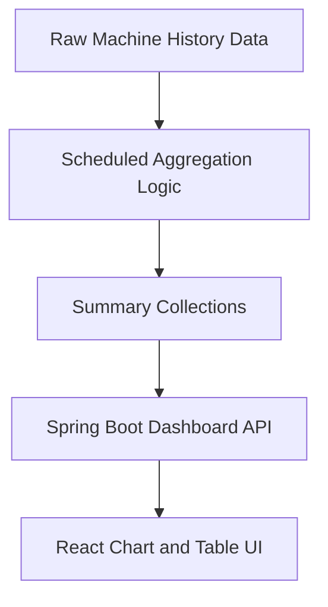
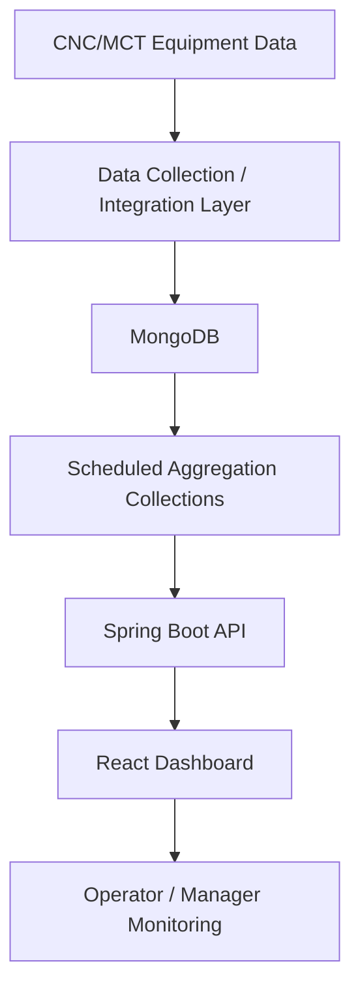
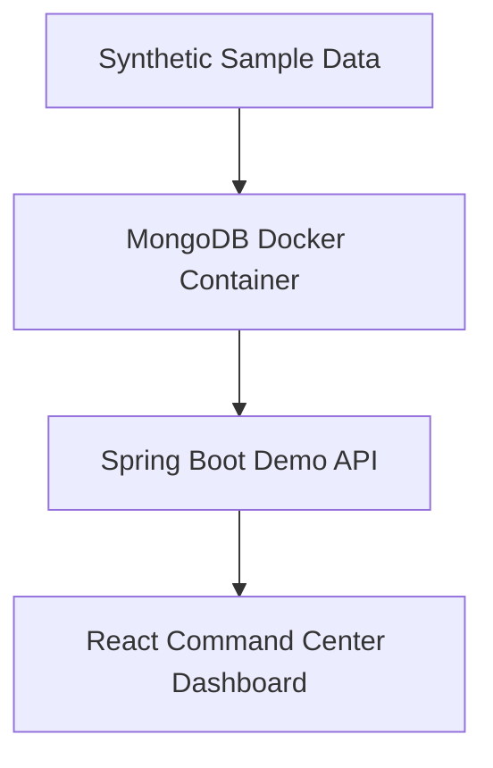

# 케이스 스터디: CNC/MCT 제조 대시보드

## 1. 개요

CNC/MCT 설비 모니터링 및 운영 분석을 위해 실제 운영·배포한 제조 대시보드 프로젝트를 정리한 케이스 스터디입니다.

운영 시스템 자체는 이 공개 저장소에 포함되지 않습니다. 이 문서는 익명화·정제된 정보만으로 기술적 문제, 개발 과정의 도전 과제, 아키텍처, 구현 방식, 배운 점을 설명합니다. 공개 저장소는 합성 샘플 데이터를 사용해 동일한 엔지니어링 개념을 재구성한 포트폴리오 데모입니다.

운영 환경 배포 시스템이었으므로 운영 소스코드, 운영 DB 연결, 운영 스크린샷, 고객 정보, 실제 설비 데이터·알람 로그, 서버 주소, 인증 정보, 비공개 Git 히스토리, 내부 배포 구성은 공개 저장소와 이 문서에서 제외했습니다.

## 2. 배경 및 문제

CNC/MCT 설비 데이터를 수집·저장·가공해 대시보드로 시각화하는 제조 환경에서 개발한 프로젝트입니다. 작업자와 관리자는 설비 가동률, 가동시간(RunTime) 대비 절삭시간(CutTime) 비율, 알람 이력, 설비 상태 분포, 일별 운영 추세를 실무적으로 검토할 방법이 필요했습니다.

대시보드의 목적은 원천 설비 데이터를 그대로 보여주는 것이 아니라, 수집된 설비 레코드를 일상적 모니터링과 검토에 쓸 수 있는 의미 있는 운영 지표로 변환하는 것이었습니다.

해결해야 할 핵심 문제는 다음과 같았습니다:

- 여러 CNC/MCT 설비의 상태를 한눈에 검토하기 어려움
- RunTime/CutTime 레코드를 의미 있는 가동률·절삭비율 지표로 변환 필요
- 알람 이력을 설비·기간·알람코드·심각도로 검색 가능하게 구성 필요
- 대용량 설비 이력 데이터로 인한 조회 성능 및 프론트엔드 렌더링 부담
- 원천 레코드가 아니라 일상 운영 검토용 실무 지표가 필요한 현장 사용자
- 설비 이력 데이터가 증가해도 안정적으로 유지되어야 하는 대시보드 응답 속도

## 3. 주요 도전 과제

### 3.1 의미 있는 설비 지표 정의

가장 중요한 과제는 현장 사용자에게 실제로 의미 있는 설비 데이터가 무엇인지 정의하는 것이었습니다. 수집 데이터에는 많은 신호·상태값·타임스탬프가 있었지만, 모든 값이 작업자나 관리자에게 유용하지는 않았습니다.

현장 이해관계자와 함께 데이터를 검토하며 다음을 명확히 했습니다: 어떤 설비 상태값을 가동/정지/알람/연결끊김으로 볼 것인가, 어떤 레코드를 가동률 분석에 쓸 것인가, RunTime과 CutTime을 어떻게 해석할 것인가, 어떤 알람을 우선할 것인가. 이 과정을 통해 대시보드 범위를 가동률, 절삭비율, 알람 이력, 상태 분포, 일별 추세라는 실무 지표 중심으로 정리했습니다.

### 3.2 대용량 설비 이력 데이터 처리

또 다른 큰 과제는 수집 데이터의 규모였습니다. 모든 대시보드 화면이 원천 이벤트 레코드를 직접 조회했다면 느린 API 응답, 무거운 프론트엔드 렌더링, 큰 차트 페이로드, 화면마다 중복되는 계산 로직 문제가 발생했을 것입니다.

이를 해결하기 위해 **원천 운영 데이터와 대시보드용 요약 데이터를 분리**했습니다. 자주 쓰이는 지표를 페이지 로드 시점에 매번 계산하는 대신, 사전 집계해 요약 컬렉션에 저장했습니다. 대시보드 API는 매 요청마다 대용량 원천 이력을 스캔하지 않고 사전 집계된 컬렉션에서 읽어, 응답 속도와 렌더링 안정성을 확보했습니다.

### 3.3 제조 데이터 의미 해석

원천 설비 레코드는 대시보드 지표로 직접 쓸 수 없었습니다. 예를 들어 RunTime과 CutTime은 스냅샷 값을 단순 합산하는 것이 아니라 운영 시간 구간 기준으로 해석해야 했습니다. 집계 로직을 명시적인 시간 윈도 규칙 기반으로 설계해, 유효한 설비 이벤트 구간에서 가동시간과 절삭시간을 계산했습니다. 그 결과 화면에 표시되는 가동률·절삭비율이 원천 레코드 값이 아니라 데이터의 운영적 의미를 반영하게 되었습니다.

### 3.4 설비 코드 매핑 불일치 해결

내부 설비 마스터 코드와 수집 데이터의 설비 식별자가 일치하지 않는 문제가 있었습니다. 마스터 데이터와 수집 데이터가 서로 다른 식별자를 써서 대시보드 집계가 올바른 설비 레코드를 찾지 못하는 경우가 발생했습니다. 마스터 데이터와 수집 데이터 간 명확한 매핑 규칙을 정의해, 일별 요약과 설비별 대시보드 API가 일관되게 올바른 레코드를 집계하도록 했습니다.

### 3.5 MongoDB 배포 환경 제약

운영 MongoDB 환경에 버전·호환성 제약이 있어 일부 최신 집계 연산자와 쿼리 패턴을 쓸 수 없었습니다. 패턴 매칭, 날짜 범위 필터링, 집계 단계, 응답 형태 가공, 쿼리 성능을 배포 환경과 호환되는 방식으로 작성해야 했습니다. 운영 환경과 호환을 유지하면서도 프론트엔드에 바로 쓸 수 있는 대시보드 데이터를 반환하도록 백엔드를 조정했습니다.

## 4. 해결 방식

MongoDB 기반 Spring Boot API와 React 대시보드로 구성했습니다. 백엔드는 설비 운영 레코드, runtime/cuttime 데이터, 설비 상태 레코드, 알람 이력을 대시보드용 응답으로 집계하고, 프론트엔드는 이를 KPI 카드, 차트, 설비별 요약, 필터, 알람 이력 테이블로 시각화했습니다.

가장 중요한 설계 결정은 **원천 데이터와 대시보드용 요약 데이터의 분리**였습니다.

원천 데이터는 상세 분석용으로 유지하고, 대시보드는 빠른 시각화에 최적화된 요약 컬렉션을 사용해 유지보수성과 성능을 동시에 확보했습니다.

## 5. 아키텍처

운영 환경 아키텍처는 개념적으로 다음과 같이 구성했습니다:

공개 데모는 동일한 개념을 로컬 전용 합성 데이터로 재구성합니다. 운영 설비 인터페이스, 운영 인증, 운영 인프라, 고객별 구현은 데모에 포함하지 않습니다.

## 6. 구현 핵심

**백엔드 (Spring Boot)** — 읽기 중심 대시보드 엔드포인트가 프론트엔드용 데이터 구조를 반환합니다. MongoDB 조회, 설비 운영 데이터 집계, 가동률·RunTime/CutTime 지표 준비, 알람 이력 요약, 상태 분포 데이터, 차트/테이블용 응답 형태 가공을 담당합니다.

**MongoDB 데이터 모델링** — 원천 설비 이력, runtime/cuttime 레코드, 알람 이력, 설비 상태 레코드, 대시보드용 요약 컬렉션을 분리해 중복 조회 비용을 줄이고 성능을 안정화했습니다.

**스케줄 집계** — 자주 접근하는 지표를 스케줄 집계 로직으로 요약 데이터화해, 정상 사용 중 비싼 원천 데이터 스캔을 줄였습니다.

**프론트엔드 (React)** — 원천 데이터 탐색기가 아니라 일상 모니터링용 실무 대시보드로 설계했습니다. 빠른 KPI 검토, 차트 기반 운영 가시성, 설비별 비교, 알람 필터링(기간·설비·알람코드·심각도), 일별 추세 시각화에 집중했습니다.

## 7. 담당 역할 및 결과

**역할: 단독 개발**

제조 데이터 구조 및 대시보드 요구사항 분석, 현장 요구사항 논의를 통한 핵심 설비 지표 선정, MongoDB 쿼리·집계 로직 설계, 요약 데이터 구조 설계, 스케줄 집계 구현, Spring Boot API 구현, React 대시보드 및 차트 시각화 구현, 필터 구현, 로컬 런타임 테스트 및 배포 워크플로 지원, 아키텍처·데이터 흐름·보안 경계 문서화, 합성 데이터 기반 공개 데모 재구성을 수행했습니다.

주요 성과:

- CNC/MCT 설비 상태·가동률·절삭비율·알람·일별 추세를 단일 대시보드에서 검토 가능하게 함
- RunTime/CutTime 레코드를 대시보드용 절삭비율 지표로 변환
- 설비·기간·심각도·알람코드 기준 알람 이력 검토 지원
- 원천 이력과 사전 집계 요약 컬렉션 분리로 대시보드 응답성 개선 및 렌더링 부하 감소
- 제조 분석을 위한 유지보수 가능한 Spring Boot API + React 대시보드 구조 확립

이 공개 케이스 스터디에는 고객별 KPI 값, 운영 레코드, 운영 성능 수치를 공개하지 않습니다.

## 8. 배운 점

- 제조 대시보드는 어떤 데이터가 실제로 유용한지 정의하기 위한 현장 수준의 논의가 필요하다.
- 원천 설비 데이터와 대시보드용 분석 데이터를 분리해야 한다.
- 시간 기반 집계 규칙은 명시적이고 일관되게 적용해야 한다.
- 스케줄 요약 컬렉션은 대시보드 조회·렌더링 성능 문제를 줄일 수 있다.
- 설비 코드 매핑은 집계 불일치를 막기 위해 초기에 명확히 해야 한다.
- 대시보드 API는 원천 DB 레코드가 아니라 프론트엔드용 응답 구조를 반환해야 한다.
- 운영 시스템의 공개 포트폴리오 버전은 비공개 소스 복사가 아니라 합성 데이터로 재구성해야 한다.
- 런타임 스모크 테스트와 문서화는 기술 포트폴리오 데모의 신뢰도를 높인다.

## 9. 공개 범위 및 한계

이 공개 저장소는 운영 프로젝트가 아니라, 동일한 엔지니어링 개념(제조 대시보드 아키텍처, Spring Boot API 설계, MongoDB 기반 분석, React 대시보드, 합성 데이터 생성, Docker 로컬 런타임, 읽기 전용 커맨드 센터 UI, 보안을 고려한 공개 통제)을 합성 데이터로 재구성한 정제 버전입니다.

원본 운영 작업은 비공개 프론트엔드·백엔드 저장소에서 개발했습니다. 해당 저장소와 커밋 히스토리는 비공개 구현 세부, 내부 네이밍, 운영 경로, 인프라 구성, 고객별 컨텍스트, 운영 전용 보안 설정을 포함할 수 있어 공개 포트폴리오에서 의도적으로 제외했습니다.

다음 항목은 공개 포트폴리오 안전을 위해 의도적으로 제외했습니다: 고객명, 운영 스크린샷·소스코드, 전체 운영 DB 스키마, 실제 설비 식별자·이력·알람 레코드, 실제 서버 주소, 인증·인프라 값, 비공개 배포 구성, 비공개 Git 히스토리.
