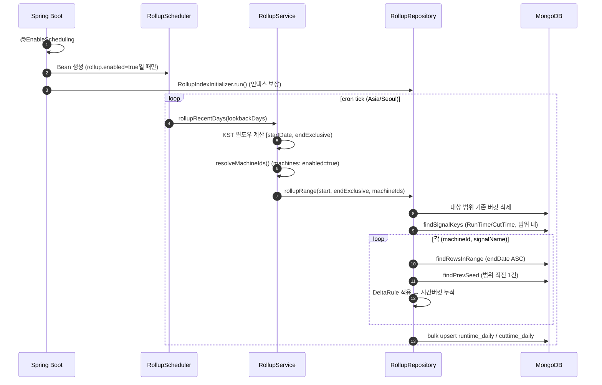

# 롤업 집계 엔진 아키텍처

이 문서는 이 프로젝트의 핵심 엔지니어링 자산인 **누적 신호 → 시간단위 델타 롤업 집계 엔진**을 설명합니다. 원본 프로덕션 시스템의 집계 파이프라인을 동일한 알고리즘으로 재구성한 것이며, 공개 저장소에서는 합성 신호 데이터에 대해 동작합니다.

## 1. 무엇을 집계하는가

- **목적**: 설비에서 수집되는 누적 카운터(`RunTime*`, `CutTime*`)를 시간 단위 델타로 변환해 요약 컬렉션에 upsert.
- **집계 단위**: `machineId + baseDate(KST 00:00) + hour(KST 0~23)`.
- **파이프라인**: `RollupScheduler` → `RollupService` → `RollupRepository` → Mongo `bulk upsert`.

컬렉션:

| 역할 | 컬렉션 |
| --- | --- |
| 소스(원천 누적 신호) | `machine_signal_pool` |
| 타깃(시간별 가동시간) | `runtime_daily` |
| 타깃(시간별 절삭시간) | `cuttime_daily` |

코드 위치(`backend/src/main/java/com/demo/cnc/rollup/`):

- `RollupScheduler` — 스케줄 트리거 (`@ConditionalOnProperty`, `@Scheduled`)
- `RollupService` — 윈도우 계산, 설비 목록 resolve, 검증
- `RollupRepository` — 집계 본체(신호 조회 → 델타 → 버킷 → upsert)
- `RollupIndexInitializer` — 소스/타깃 인덱스 보장 (`ApplicationRunner`)
- `RollupBackfillRunner` — 히스토리 1회 백필 (CLI 프로퍼티)
- `DeltaRule` — 델타 보정 규칙(순수 함수, 단위 테스트 대상)

## 2. 왜 델타가 필요한가

`RunTime`/`CutTime`은 설비가 켜진 이후 계속 증가하는 **누적 카운터**입니다. 스냅샷 값을 단순 합산하면 지표가 왜곡되므로, 연속된 두 값의 차이(델타)로 실제 구간 가동/절삭 시간을 계산해야 합니다.

원천 데이터에는 다음 문제가 섞여 있어 그대로 델타를 쓰면 안 됩니다:

- 설비 재부팅 등으로 카운터가 초기화되어 **값이 감소**하는 경우
- 유휴/정지로 **오랫동안 신호가 없다가** 다시 들어오는 경우
- 일시적 오류로 **비정상적으로 큰 점프**가 생기는 경우

## 3. 델타 보정 규칙 (`DeltaRule`)

`DeltaRule.resolve(prevValue, prevMs, curValue, curMs)`는 다음 순서로 델타(초)를 계산합니다:

1. `rawDelta = cur - prev`
2. `rawDelta <= 0` → `0` (카운터 리셋/비증가 차단)
3. `gapSec <= 0` → `0` (역순/중복 타임스탬프 차단)
4. `gapSec > 600` → `0` (10분 초과 갭은 정지로 간주해 버림)
5. `cap = min(gapSec, 120)` → `delta = min(rawDelta, cap)`

해석:

- 단일 스텝이 반영할 수 있는 최대치는 **120초**로 상한.
- 소스 간격이 **10분을 초과**하면 그 구간 델타는 버림(유휴/정지 구간이 가동으로 잡히는 것 방지).

이 규칙은 DB에 의존하지 않는 순수 함수라 `DeltaRuleTest`로 케이스별 검증합니다(정상 스텝, 리셋 드롭, 점프 캡, 긴 갭 드롭, 역순 드롭, 짧은 갭 캡).

## 4. 실행 플로우

## 5. 윈도우 계산 (KST/UTC)

`RollupService.rollupRecentDays(int, List)`:

- `windowDays = max(1, lookbackDays)`
- `executedAtKst = now(Asia/Seoul)`
- `endDateExclusive = executedAtKst.toLocalDate() + 1`
- `startDate = endDateExclusive - windowDays`

즉 오늘(KST)을 포함해 최근 `lookbackDays`일을 `[startDate, endDateExclusive)`로 집계합니다.

시간대 처리:

- Mongo 조회 필터는 UTC instant 기준(`endDate`).
- 버킷의 `baseDate`/`hour`는 **KST 기준**으로 계산.
- 저장되는 `baseDate`는 KST 자정을 나타내는 UTC instant(BSON Date).

## 6. overwrite 보장 전략

1. 집계 시작 전, 대상 범위의 기존 버킷을 삭제(`baseDate` 범위 + `machineId`).
2. 이후 동일 버킷에 bulk upsert — 키 충돌 시 덮어쓰기, 신규면 insert.
3. unique 인덱스 `ux_rollup_machineId_baseDate_hour`로 중복 방지.

이로써 같은 구간을 여러 번 재집계해도 결과가 멱등(idempotent)합니다.

## 7. 인덱스

`RollupIndexInitializer`가 앱 시작 시 보장:

- 소스 `machine_signal_pool`: `idx_signal_machineId_signalName_endDate` — 설비·신호별 범위 스캔 최적화.
- 타깃 `runtime_daily` / `cuttime_daily`: `ux_rollup_machineId_baseDate_hour` (unique) — upsert 조회 + 중복 방지.

## 7-1. 읽기 API의 상향 집계 (roll-forward)

시간 버킷은 최소 집계 단위이고, 상위 기간 뷰는 버킷을 그대로 상향 합산합니다:

- `GET /api/rollup/hourly?date=` — 하루의 시간별 버킷
- `GET /api/rollup/daily?year=&month=` — 한 달의 일별 합계
- `GET /api/rollup/monthly?year=` — 한 해의 월별 합계

원천 신호는 어떤 조회 경로에서도 다시 스캔하지 않습니다. (`RollupQueryService`)

## 8. 운영 모드 vs 백필 모드

| 항목 | 운영(스케줄) | 백필(1회) |
| --- | --- | --- |
| 트리거 | `@Scheduled(cron)` | 앱 시작 시 `ApplicationRunner` |
| 활성화 | `rollup.enabled=true` | `rollup.backfill.enabled=true` |
| 범위 | 최근 `lookback-days` | `from`~`to`(exclusive) 명시 |
| 부하 | 짧고 자주 | 길고 드물게 |
| 호출 경로 | 동일 (`Service → Repository`) | 동일 |

흐름은 동일하고 차이는 **트리거 주기**와 **윈도우 길이**뿐입니다.

## 9. 트러블슈팅 (버킷 0건일 때)

1. `rollup.enabled=false` → 스케줄러 빈이 생성되지 않음.
2. `machines`에 `enabled=true` 설비가 없음 → 대상 없음으로 스킵.
3. 소스 `signalName`이 `RunTime`/`CutTime` prefix가 아님 → 제외.
4. 조회 윈도우 밖(시간대 착시): 필터는 UTC, 버킷은 KST. `startUtc/endUtc` 기준으로 `endDate` 확인.
5. 보정 규칙으로 전부 0: 리셋/음수, 10분 초과 갭, 120초 cap으로 유효 델타가 사라질 수 있음.
6. 범위 오류: `startDate < endDateExclusive`가 아니면 서비스에서 즉시 스킵.

## 10. 공개 재구성 노트

원본 프로덕션 시스템은 실제 설비 인터페이스에서 신호를 수집하고, 설비 마스터 매핑·인증·배포 인프라를 포함했습니다. 이 공개 문서와 코드는 **집계 알고리즘과 파이프라인 구조만** 중립 네이밍으로 재구성한 것이며, 운영 컬렉션명·설비 식별자·내부 경로·인증/인프라 값은 포함하지 않습니다.
